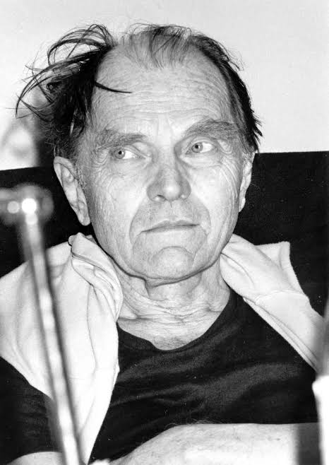

# Metodologia Econômica
### Conceitos Filosóficos, Epistemologias e o Método Científico

Daniel de Abreu Pereira Uhr  
DECON/UFPel - PPGOM  
Ciências Econômicas  

---

**Sumário**

1. Conceitos Filosóficos 
2. Epistemologias e o Método Científico
       2.1 KARL POPPER (1902-1994)
       2.2 THOMAS KUHN (1922-1996)
       2.3 IMRE LAKATOS (1922-1974)
       2.4 PAUL FEYERABEND (1924-1994)
       2.5 MARIO BUNGE (1919-2020)

---

# 1. Conceitos Filosóficos

A filosofia da ciência ou epistemologia propõe-se a responder questões já há muito formuladas como:
* O que conhecemos? 
* Como conhecemos? 
* O que é o conhecimento científico? 
* O que faz a ciência? 

e outras tantas perguntas nessa linha. De modo geral, as abordagens quanto a produção do conhecimento são indutivas ou dedutivas. 

---
# 1. Conceitos Filosóficos

**Indutivismo**: Filosofia da ciência que supõe que o conhecimento científico é produzido por indução: observa-se meticulosamente, mede-se rigorosamente, obtém-se um bom número de dados confiáveis e chega-se (induz-se) a uma lei científica. Quando faz referência a uma base empírica segura, o indutivista quer dizer que ela é constituída por um grande número de observações, que tais observações foram feitas em uma ampla variedade de situações e que nenhuma delas contradiz a lei universal derivada (induzida).

**Dedutivismo:** Filosofia da ciência que supõe que o conhecimento científico é produzido por dedução: parte-se de princípios gerais e chega-se a conclusões específicas.

---
# 2. Epistemologias e o Método Científico
### Karl Popper (1902-1994)

---

# 2. Epistemologias e o Método Científico
### Karl Popper (1902-1994)

**Formação**: Universidade de Viena (doutoramento em filosofia em 1928) e ensinou em uma escola secundária entre 1930 e 1936. Em 1937, devido à ascensão do Nazismo, emigrou para a Nova Zelândia, onde foi professor no Canterbury University College. Em 1946, mudou-se para a Inglaterra, tornando-se assistente de lógica e de método científico na London School of Economics, onde foi nomeado professor em 1949.

**Biografia**: Membro do partido comunista da Áustria. Ao questionar os líderes do partido sobre a morte de colegas em uma manifestação, recebeu a resposta de que essas mortes eram "necessárias para a revolução", o que o impactou profundamente. Popper começou a questionar a ideologia marxista. Com o tempo, rejeitou completamente o marxismo e tornou-se um liberal. Em 1947, fundou  com Friedrich Hayek, Milton Friedman, Ludwig von Mises e outros, a *Mont Pelerin Society* para defender o liberalismo clássico, no espírito da "Open Society".

---
# 2. Epistemologias e o Método Científico

A ideia vigente até então era de que a ciência se distinguia da pseudociência pelo uso do método empírico, que as teorias eram obtidas por indução e que o critério de demarcação era o da verificabilidade. Popper critica o método da verificabilidade.

Para salvar uma teoria da refutação, seus seguidores podem formular hipóteses **ad hoc** (não refutáveis, para aquele fim específico).

Para Popper, o critério de refutabilidade permite traçar uma linha divisória entre as ciências empíricas e todas as outras áreas de caráter religioso, metafísico ou pseudocientífico. Ou seja, o critério da **refutabilidade** ou **testabilidade** é a solução para o problema da demarcação entre ciência e não-ciência.

---

# 2. Epistemologias e o Método Científico

Procedimento mais Razoável: Método Crítico

**Método Crítico**: também chamado de método das tentativas de refutação. Consiste em fazer conjeturas, chegar a conclusões genéricas e tentar refutá-las incessantemente.

**Progresso Científico**: O progresso ocorre pela reiterada substituição de teorias científicas por outras cada vez mais satisfatórias.

**Crítica ao Indutivismo**: Popper rejeita o método indutivista como critério de demarcação e propõe a **lógica falsificacionista**, ou seja, a testabilidade e refutabilidade como critérios para distinguir entre teorias científicas e não científicas.

Para Popper, ao contrário do que se espera, as expectativas, hipóteses ou teorias **precedem** os problemas. Aliás, os problemas somente surgem quando as teorias enfrentam dificuldades ou contradições. Assim, os problemas despertam o desafio de aprender e de avançar no conhecimento.

---
# 2. Epistemologias e o Método Científico

**Racionalismo Crítico**: Trata-se de uma atitude crítica na busca de teorias, ainda que falíveis, que permitam progredir além das teorias precedentes, ou seja, que consigam resistir a testes cada vez mais rigorosos.

**Falsificação como Critério de Demarcação**: a ciência é uma construção humana feita a partir de conjecturas controladas por refutações, como forma de se obter progresso científico. A falsificação é o critério que permite *distinguir entre ciência e não-ciência*.

**Possível Limitação do Falsificacionismo**: As observações refutadoras podem ser falhas, ou seja, os enunciados observacionais são falíveis.

---
# 2. Epistemologias e o Método Científico

**Teorias Científicas**: As teorias científicas são hipóteses a partir das quais se podem deduzir enunciados comprováveis mediante a observação. Se as observações experimentais adequadas revelam esses enunciados como falsos, a hipótese é refutada. Se uma hipótese supera o esforço de demonstrar sua falseabilidade, pode ser aceita, ao menos em caráter provisório. Nenhuma teoria científica, entretanto, pode ser estabelecida de forma definitiva.

---
# 2. Epistemologias e o Método Científico
### Thomas Samuel Kuhn (1922-1996)

---
# 2. Epistemologias e o Método Científico
### Thomas Samuel Kuhn (1922-1996)

**Formação**: Formou-se em Física (*summa cum laude*) em 1943, pela Universidade de Harvard. Recebeu desta mesma instituição o grau de Mestre em 1946 e o grau de Doutor em 1949, ambos na área de Física.

**Biografia**: Kuhn tornou-se professor em Harvard, onde lecionou uma disciplina de Ciências para alunos de Ciências Humanas. Em 1956, Kuhn foi lecionar História da Ciência na Universidade da Califórnia, em Berkeley. Tornou-se professor efetivo desta instituição em 1961. Em 1964, assumiu a posição de Professor M. Taylor Pyne de Filosofia e História das Ciências na Universidade de Princeton. Em 1971, Kuhn foi lecionar no MIT, onde permaneceu até terminar a sua carreira acadêmica.

---
# 2. Epistemologias e o Método Científico

**Conceitos:** Ciência Normal, Revoluções Científicas, Paradigma, Incomensurabilidade

**Ciência Normal**: Período de pesquisa baseada em realizações que são reconhecidas durante algum tempo por uma comunidade científica como fornecedoras dos fundamentos para a sua prática investigativa.

**Paradigma**: Conjunto de realizações, normalmente reunidas em livros ou manuais, que definem os problemas, crenças, valores e métodos legítimos de um dado campo de pesquisa, e que são partilhados por uma comunidade.

Kuhn sugere que a ciência madura se caracteriza pela adoção de um paradigma. Uma teoria pode transformar-se em um paradigma desde que seus seguidores a considerem melhor do que as teorias concorrentes.

---
# 2. Epistemologias e o Método Científico

**Conceitos de Problemas Extraordinários, Anomalias e Revoluções Científicas**

Existem também os **problemas extraordinários**, anomalias ou pesquisas extraordinárias, que surgem em ocasiões especiais como resultado do avanço da ciência normal. Se anomalias sérias se acumulam, elas podem levar o paradigma a uma crise. Quando essa crise culmina na formulação de teorias radicalmente novas, forçando os cientistas a uma transição para um novo paradigma, ocorre o que Kuhn chama de **revolução científica**.

--- 
# 2. Epistemologias e o Método Científico

**Conceitos de Problemas Extraordinários, Anomalias e Revoluções Científicas**

Outra condição necessária para que uma comunidade científica abandone uma teoria que adquiriu o status de paradigma é a existência de **teorias alternativas** para substituí-la. A emergência de novas teorias rompe com a tradição de práticas científicas e introduz uma nova tradição, regida por regras diferentes e inserida em um universo de discurso também diferente. Assim, segundo Kuhn, o velho e o novo paradigma são **incomensuráveis**.

**Possível Limitação**: Talvez seja equivocado afirmar que a ciência avança somente através de revoluções esporádicas, entendidas como mudanças radicais, capazes de provocar o abandono de um conjunto de crenças e métodos em favor de outro.

---
# 2. Epistemologias e o Método Científico
### Imre Lakatos (1922-1974)

---
# 2. Epistemologias e o Método Científico
### Imre Lakatos

**Nome**: Nasceu Imre Lipschitz, mudou para Imre Molnár, e depois trocou de nome para Imre Lakatos.

**Biografia**: De família judia, nasceu na Hungria. Graduou-se em matemática, física e filosofia na Universidade de Debrecen em 1944. Continuou seus estudos de doutorado na Universidade de Debrecen em 1948 e também estudou na Universidade Estatal de Moscou. Após a União Soviética invadir a Hungria em novembro de 1956, Lakatos fugiu para Viena e, mais tarde, chegou à Inglaterra. Doutorou-se em filosofia em 1961 na Universidade de Cambridge. Em 1960, foi nomeado para um cargo na London School of Economics, onde trabalhou em seus escritos sobre filosofia da matemática e filosofia da ciência. O departamento de filosofia da LSE na época incluía Karl Popper e John Watkins.

---
# 2. Epistemologias e o Método Científico

**Avanço do Conhecimento Científico segundo Imre Lakatos**

O avanço do conhecimento científico consiste na permanente substituição de **programas de pesquisa científica regressivos** por programas de pesquisa **progressivos** e, de forma subjacente, na constante substituição de hipóteses.

**Programas de Pesquisa Científica**: Definem o conjunto de regras que indicam a rota a ser seguida pela investigação em uma determinada área do conhecimento, garantindo assim a continuidade da pesquisa.

---

# 2. Epistemologias e o Método Científico

Discípulo de Popper, Lakatos fez uma **crítica ao falsificacionismo dogmático de Popper** (a ideia de avanço da ciência por meio de conjecturas e refutações), argumentando que a metodologia dos programas de pesquisa científica não oferece uma racionalidade instantânea. Segundo ele, pode levar muito tempo (até décadas) para que um programa se torne progressivo ou regressivo. A crítica a uma teoria, portanto, não tem como objetivo a morte rápida por refutação; o programa é estruturado para evitar essa consequência.

A ciência cresce por meio de **hipóteses audazes** e modificações que devem ser capazes de serem testadas, e algumas são eliminadas por refutações sólidas. Além disso, não há refutações sem a emergência de teorias melhores. Em outras palavras, a ciência não avança por meio de conjecturas isoladas, mas através de **programas de pesquisa**.

---
# 2. Epistemologias e o Método Científico

**Tipos de Teorias e Falsificacionismo Metodológico**

**Teorias Passivas**: Originadas da observação (empirismo clássico).

**Teorias Ativas**: Pressupõem atividade mental. O conhecimento autêntico está associado às teorias ativas e à ideia de que, conforme a ciência cresce, diminui o poder da evidência empírica. (Em concordância com a construção do conhecimento segundo Kuhn e Popper).

**Falsificacionismo Metodológico de Base Evolutiva**: A falsificação, por si só, não se sustenta, pois não há falsificação sem a emergência de uma nova teoria, e esta deve oferecer alguma informação nova quando comparada com sua antecessora. Não são apenas os dados empíricos que decidem pela aceitação ou refutação de teorias; em alguns casos, as decisões e acordos da comunidade científica também influenciam.

---
# 2. Epistemologias e o Método Científico

**Continuidade dos Programas de Pesquisa**: As teorias formam séries que se agrupam em programas de pesquisa científica, caracterizados por uma certa continuidade que relaciona seus membros.

**Programa de Pesquisa**: Consiste em regras metodológicas que orientam a pesquisa científica.

**Heurística Negativa**: Orientação do programa de pesquisa sobre qual caminho **NÃO** deve ser seguido. Protege o núcleo duro do programa de pesquisa, que é composto por um conjunto básico de hipóteses protegidas contra refutações, formando o chamado cinturão protetor.

**Heurística Positiva**: Orientação do programa de pesquisa sobre qual caminho **deve** ser seguido (cada vez mais complexo). Está vinculada ao cinturão protetor, um conjunto de hipóteses auxiliares contra as quais colidem as refutações e contrastações.

---
# 2. Epistemologias e o Método Científico

**Núcleo Duro**: Característica que define o programa de pesquisa e não deve ser refutada pelos defensores do programa.

**Cinturão Protetor**: Caracterizado pela constante invenção de hipóteses auxiliares, que podem sofrer modificações, refutações, avanços, retrocessos, idas e vindas, com o objetivo de proteger o núcleo firme do programa de pesquisa.

---
# 2. Epistemologias e o Método Científico

**Diferença entre Hipóteses Ad Hoc e Hipóteses Auxiliares**

Há uma diferença fundamental entre **hipóteses ad hoc** e **hipóteses auxiliares**, que não deve gerar confusões. As hipóteses auxiliares integram o cinturão protetor e são refutáveis (testáveis), enquanto as hipóteses ad hoc não são.

**Diferença para Kuhn e Popper**: As teorias não são simplesmente refutadas ao se depararem com inconsistências; ao contrário, um grande esforço é feito pelos cientistas para salvá-las, melhorando ou substituindo seus aspectos problemáticos e preservando os não problemáticos. Assim, nem o falsacionismo ingênuo (de Popper) nem a brusca revolução científica (de Kuhn) se sustentam totalmente.

**Contraponto a Kuhn**: Diferente de Kuhn, entende-se que a competição de programas de pesquisa é a regra, ao contrário da ideia de que a ciência madura é caracterizada pela adesão a um único paradigma.

---
# 2. Epistemologias e o Método Científico
### Paul Feyerabend (1924-1994)

---
# 2. Epistemologias e o Método Científico
### Paul Feyerabend (1924-1994)

**Biografia**: Serviu no exército alemão durante a Segunda Guerra Mundial. Estudou na Academia de Weimar e retornou a Viena para estudar História e Sociologia. Insatisfeito, logo passou a estudar Física. Feyerabend então escolheu Popper como seu orientador e foi estudar na London School of Economics em 1952. Em 1958, mudou-se para Berkeley, Califórnia, e tornou-se cidadão norte-americano. Ministrou aulas como professor convidado em Londres, Berlim e Yale. Em 1972 e 1974, ensinou na Universidade de Auckland, Nova Zelândia, sempre retornando à Califórnia. Nos anos 1980, Feyerabend dividiu suas funções entre a ETH, em Zurique, e Berkeley, mas deixou Berkeley em 1989, mudando-se inicialmente para a Itália e finalmente para Zurique. Após sua aposentadoria em 1991, Feyerabend continuou a publicar artigos e passou a trabalhar em sua autobiografia. Ele faleceu em 1994.

---
# 2. Epistemologias e o Método Científico

A ciência é uma empresa essencialmente **anárquica** no sentido de que não há uma única regra, embora plausível e bem fundada na epistemologia, que deixe de ser violada em algum momento.

**Anarquismo Epistemológico**: Oposição a um princípio único, absoluto e fechado para opções; contrária a tradições rígidas que pretendem estabelecer padrões universais de validade. O único princípio para o desenvolvimento do conhecimento é: **"tudo vale"**.

Defesa da **Contra-Indução**: 
**Motivos**: (1) **Ampliar o Conteúdo Empírico**: Introduzir novas concepções, alternativas diferentes e comparar ideias novas e antigas. Em geral, o cientista tenta aperfeiçoar as ideias que vão sendo superadas, ao invés de simplesmente descartá-las. (2) **Discrepância entre Hipóteses e Observações**: Nenhuma teoria está em completa harmonia com todos os fatos conhecidos em seu campo de domínio, o que favorece a discrepância entre hipóteses e observações.

---
# 2. Epistemologias e o Método Científico

A aplicação do **método científico** (positivista) impediria que a ciência existisse tal como a conhecemos. Se a ciência existe, isso significa que esses métodos foram postos de lado em nome de formas de agir provocadas por condições psicológicas, socioeconômico-políticas e outras de caráter externo.

Sugere que a regra é a **contra-regra**:
   - i) Introduzir hipóteses conflitantes com teorias bem confirmadas ou corroboradas;
   - ii) Introduzir hipóteses que não se ajustem aos fatos estabelecidos.

Dado o contexto da ciência, a razão não pode ser universal e a ausência de razão não pode ser excluída.

---
# 2. Epistemologias e o Método Científico
### Mario Bunge (1919-2020)

---
# 2. Epistemologias e o Método Científico

### Mario Bunge (1919-2020)

**Biografia**: Mario Bunge nasceu em Buenos Aires, Argentina. Graduou-se na Universidade Nacional de La Plata, onde concluiu seu doutorado em ciências físico-matemáticas em 1952. Foi físico teórico e professor de Filosofia da Ciência na Universidade McGill, no Canadá.

Bunge defendia uma visão científica rigorosa e inovadora, tendo a Física como paradigma da ciência e uma das principais fontes para a elaboração filosófica. Segundo ele:

*"A Física tem constituído o paradigma da ciência e o principal provedor de materiais para a elaboração filosófica."*

---
# 2. Epistemologias e o Método Científico

Bunge criticou o operacionalismo, uma abordagem extrema do empirismo, caracterizada por alguns dogmas:

* A observação é a única fonte de conhecimento.
* Hipóteses e teorias são meras sínteses indutivas.
* As teorias não são criadas, mas descobertas.
* O objetivo das teorias é sistematizar a experiência humana.
* Teorias que incluem conceitos não derivados da observação são rejeitadas.

Para Bunge, essa filosofia ainda presente na ciência, especialmente na Física, deveria ser substituída por uma visão mais contemporânea, que tornasse o cientista mais crítico e criativo.

---
# 2. Epistemologias e o Método Científico

**Construção da Ciência**

Bunge via a ciência como uma construção humana, um corpo crescente de ideias estruturadas em:

* Conhecimento racional: Baseado na lógica e na análise.
* Conhecimento verificável: Submetido a testes empíricos e experimentais.
* Falibilidade: O conhecimento científico é imperfeito, mas pode ser continuamente aprimorado.

---
# 2. Epistemologias e o Método Científico

**Ciência Formal e Ciência Fática**

* Ciência Formal: Inclui disciplinas como Lógica e Matemática, que produzem conhecimento racional, sistemático e verificável, mas não tratam diretamente da realidade concreta. Seu foco é em entes abstratos que existem apenas no pensamento humano.

* Ciência Fática: Baseia-se na formulação de hipóteses sobre fatos ou objetos materiais. Características principais:
  * Os enunciados fáticos devem ser verificáveis direta ou indiretamente.
  * O conhecimento requer modelagem conceitual dos fatos com base na experiência.

---
# 2. Epistemologias e o Método Científico

**Requisitos para o Conhecimento Científico**
* **Verificabilidade**
  * O conhecimento científico exige que os procedimentos usados para obter dados sejam descritos objetivamente e possam ser reproduzidos por outros.

* **Método Científico**
  * O método científico é flexível e adaptável, incluindo ferramentas como indução, analogia e dedução. A única exigência invariável é a verificabilidade.

* **Modelos Científicos**
  * Modelos conceituais fornecem representações simbólicas da realidade.
  * Modelos teóricos atribuem propriedades aos conceitos fundamentais.

---
# 2. Epistemologias e o Método Científico

**Visão Epistemológica**

A epistemologia de Mario Bunge é marcadamente racionalista e realista. Ele acreditava que:

* Todo campo do conhecimento pode ser axiomatizado, mas de forma moderna, especialmente na Física.
* Cada fórmula deve ser acompanhada de uma assunção semântica para esclarecer o significado físico dos conceitos fundamentais.

Embora Bunge valorizasse a verificabilidade como característica essencial das ciências naturais (ou fáticas), ele reconhecia que a verificabilidade não garante que hipóteses científicas sejam definitivas. Assim, para ele, a ciência é um processo contínuo e falível, mas orientado para a verdade.

---

# 3. Resumo
### Pontos centrais das Epistemologias

---

### Karl Popper (1902-1994)

* Epistemologia: Racionalismo crítico.
* Método Científico: Falsificacionismo. Popper argumenta que a ciência progride ao refutar teorias, não ao confirmá-las. Uma hipótese é científica se puder ser falsificada.
  * A ciência nunca prova nada definitivamente; ela apenas elimina erros.
  * Exemplo: A hipótese "Todos os cisnes são brancos" pode ser falsificada ao encontrar um cisne negro.
* Visão: A ciência é um processo contínuo de conjecturas e refutações. Não existe "certeza", mas sim aproximações melhores da verdade.

---
### Thomas Kuhn (1922-1996)
* Epistemologia: Estruturalismo histórico da ciência.
* Método Científico: Paradigmas científicos e revoluções científicas.
  * A ciência progride por meio de períodos de "ciência normal", onde há consenso dentro de um paradigma (conjunto de crenças e métodos compartilhados).
  * Crises surgem quando anomalias acumulam-se e o paradigma não pode mais explicá-las, resultando em uma revolução científica.
* Exemplo: A transição do modelo geocêntrico para o heliocêntrico.
* Visão: O progresso científico não é linear ou cumulativo, mas sim uma sequência de mudanças de paradigma, cada um com suas próprias regras e métodos.

---
### Imre Lakatos (1922-1974)
* Epistemologia: Programas de pesquisa científica.
* Método Científico: Programas de pesquisa progressivos e degenerativos.
  * Propôs um meio-termo entre Popper e Kuhn. A ciência avança por meio de programas de pesquisa, cada um com um "núcleo teórico" protegido por hipóteses auxiliares.
  * Um programa é progressivo se prevê novos fatos e se ajusta para resolver problemas. É degenerativo se se limita a ajustar hipóteses sem produzir novos insights.
* Exemplo: A física newtoniana foi um programa progressivo por séculos, mas tornou-se degenerativo com o advento da relatividade.
* Visão: Teorias não são refutadas isoladamente; é o progresso ou a estagnação de todo o programa de pesquisa que deve ser avaliado.

---
### Paul Feyerabend (1924-1994)
* Epistemologia: Anarquismo epistemológico.
* Método Científico: "Anything goes" (Tudo vale).
  * Criticou a ideia de um método científico universal, argumentando que a ciência avança por meio de práticas diversas e muitas vezes caóticas.
  * Exemplos históricos mostram que métodos não científicos, como a intuição, foram cruciais para descobertas.
  * Exemplo: Galileu usou retórica e técnicas não convencionais para convencer sobre o heliocentrismo.
* Visão: Não há um critério rígido para definir ciência; o progresso depende da criatividade e da liberdade metodológica.

---
###  Mario Bunge (1919-2020)
* Epistemologia: Realismo científico.
* Método Científico: Sistema integrado de lógica, ontologia e metodologia.
  * Defendeu um método científico rigoroso baseado no realismo ontológico e na lógica formal.
  * A ciência busca explicar a realidade objetiva por meio de teorias fundamentadas em observação, experimentação e modelagem matemática.
  * Exemplo: O modelo atômico baseia-se em evidências experimentais e na lógica dedutiva.
* Visão: A ciência é um sistema organizado e progressivo, mas depende de um compromisso com a verdade objetiva e com a metodologia rigorosa.

---

### Referências
1. Popper, K. (1959). The Logic of Scientific Discovery. Routledge.
2. Kuhn, T. (1962). The Structure of Scientific Revolutions. University of Chicago Press.
3. Lakatos, I. (1978). The Methodology of Scientific Research Programmes. Cambridge University Press.
4. Feyerabend, P. (1975). Against Method. Verso.
5. Bunge, M. (1973). Epistemologia: Curso de Atualização. Editora da Universidade de São Paulo.
